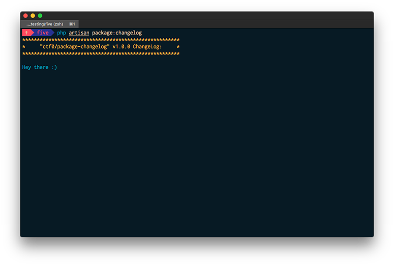

<p align="center">
    
</p>

### The Problem

usually when a package gets updated, the package owner could possibly add/change/remove something in the configuration file,
or could add a new feature that he/she didnt have time to add to the readme yet,
or for whatever reason that could potentially effect how you use the package.

and therefor this package was made, more of an opt-in feature that you can use to help your users stay up-to-date with any changes as new releases gets published.

# Installation

- add `"@php artisan package:changelog"` to your project **composer.json**

```js
"scripts": {
    ...

    "post-autoload-dump": [
        ...

        "@php artisan package:changelog"
    ]
},
```

- `composer require ctf0/package-changelog`

## Usage

- add `"changeLog": "log_folder_name"` to your package **composer.json**, ex.`logs`

```js
"extra": {
    "laravel": {
        //...

        "changeLog": "logs"
    }
},
```

- inside that folder add the log files
> note that the version have to be equal "==" to the tag version on whatever version control you are using because we check against that version b4 showing the log.
>
> this is useful incase you dont/didnt add changelog for the current published version.

   | release tag | log file name |
   |-------------|---------------|
   | v1.0.0      | v1.0.0.txt    |

- we dont use any parsers for the log file, so whatever you write in the file it will be displayed as it is to the user.

## Limitations
We rely on `/vendor/composer/installed.json` to check which installed package have the key `changeLog`, but as composer rebuild this file on package installation or removal only,

## ToDO
- find a way to update `/vendor/composer/installed.json` on `composer update` as well.
- auto run `php artisan package:changelog` internally after a new package is installed/updated.
- maybe add an option to fetch the changelogs automatically from github or something.
